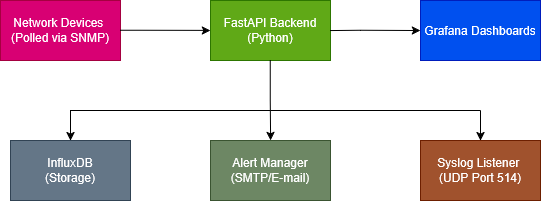

# Network Monitoring & Alerting System

A complete network monitoring stack demonstrating real-time SNMP polling, time-series storage, visualization, and alerting.


## Overview

This project demonstrates a complete monitoring architecture combining multiple technologies into one cohesive system:

- **Real SNMP Polling** of network devices (CPU, memory, bandwidth, uptime, response time)
- **Time-Series Storage** in InfluxDB for historical analysis
- **Grafana Dashboards** for real-time visualization
- **Secured FastAPI Backend** with JWT authentication and rate limiting
- **Async Email Alerting** when thresholds are breached
- **Syslog Ingestion** with pattern-based analysis and alerting

The project runs locally via Docker Compose with 15 simulated network devices.

## Architecture



## Features

### SNMP Polling Engine
- SNMP v2c polling using pysnmp 7.1.22
- Metrics collected: CPU usage, memory usage, bandwidth (in/out), uptime, response time
- Configurable poll interval (default: 60 seconds)
- Graceful timeout and retry handling
- 32-bit counter wraparound detection for bandwidth calculations
- Per-device community string support

### Time-Series Storage (InfluxDB)
- Device metrics with tags for filtering
- Syslog event storage with severity/facility metadata
- Alert history logging
- Query API with input sanitization
- Up to 168 hours (1 week) of historical data retrieval

### Grafana Dashboards
Four pre-configured dashboards auto-provisioned on startup:

| Dashboard | Purpose |
|-----------|---------|
| **Network Overview** | Fleet health status, device grid, aggregate metrics |
| **Device Details** | Per-device time-series graphs, response time tracking |
| **Alert History** | Triggered alerts, email delivery status, trends |
| **Syslog Analysis** | Message search, severity distribution, facility breakdown |

### Secured FastAPI Backend
- **JWT Authentication**: Token-based auth with configurable expiration
- **Password Security**: bcrypt hashing with salt
- **Rate Limiting**: Per-endpoint limits using slowapi
- **Security Headers**: XSS protection, CSP, HSTS, CORS
- **Input Validation**: IP address validation, Pydantic schemas

### Alerting System
- **Threshold Alerts**: CPU, memory, bandwidth, response time
- **Status Alerts**: Device offline/error detection
- **Syslog Alerts**: Severity-based and pattern matching
- **Email Delivery**: Async SMTP with persistent connection
- **Cooldown**: Prevents alert spam (default: 5 minutes)
- **Alert Logging**: All alerts stored in InfluxDB for history

### Syslog Ingestion
- UDP listener on port 514
- RFC 3164 and RFC 5424 format support
- Pattern-based alerting (auth failures, link down, config changes)
- Circular buffer for message retention
- Real-time WebSocket broadcast

## Tech Stack

| Component | Technology | Purpose |
|-----------|------------|---------|
| Backend | FastAPI + Python 3.11 | REST API, WebSocket |
| SNMP | pysnmp 7.1.22 | Network device polling |
| Time-Series DB | InfluxDB 2.7 | Metrics storage and querying |
| Visualization | Grafana 10.2.3 | Dashboards and graphs |
| Auth Storage | SQLite + SQLAlchemy | User accounts |
| Email | aiosmtplib | Async alert delivery |
| Deployment | Docker Compose | Container orchestration |

## Quick Start

### Prerequisites
- Docker and Docker Compose
- Python 3.11+ (for SNMP simulator)
- Git

### 1. Clone and Configure

```bash
git clone <repository-url>
cd network-monitoring

# Copy environment template
cp .env.example .env
```

Edit `.env` with your settings:

```bash
# Required - Generate secure values
INFLUXDB_ADMIN_PASSWORD=your-secure-password
INFLUXDB_ADMIN_TOKEN=your-secure-token-min-32-chars
GF_SECURITY_ADMIN_PASSWORD=your-grafana-password
JWT_SECRET_KEY=your-jwt-secret-min-32-chars

# Optional - Email alerting (Gmail example)
SMTP_HOST=smtp.gmail.com
SMTP_PORT=587
SMTP_USERNAME=your-email@gmail.com
SMTP_PASSWORD=your-app-password
ALERT_FROM_EMAIL=your-email@gmail.com
ALERT_TO_EMAIL=alerts@yourdomain.com
```

### 2. Start the SNMP Simulator

In a separate terminal:

```bash
# Install snmpsim if not already installed
pip install snmpsim

# Start the simulator
python start_snmp_simulator.py
```

This starts 15 simulated network devices on ports 11610-11750.

### 3. Launch the Stack

```bash
docker-compose up -d
```

### 4. Access the Services

| Service | URL | Credentials |
|---------|-----|-------------|
| Grafana | http://localhost:3000 | admin / (your password) |
| FastAPI | http://localhost:8000 | - |
| InfluxDB | http://localhost:8086 | admin / (your password) |

### 5. Create an API User

```bash
# Register a new user
curl -X POST http://localhost:8000/api/auth/register \
  -H "Content-Type: application/json" \
  -d '{"username": "user", "email": "user@example.com", "password": "yourpassword"}'

# Login to get a token
curl -X POST http://localhost:8000/api/auth/login \
  -H "Content-Type: application/x-www-form-urlencoded" \
  -d "username=demo&password=Demo1234!"
```

## API Reference

### Authentication
| Method | Endpoint | Description |
|--------|----------|-------------|
| POST | `/api/auth/register` | Create new user account |
| POST | `/api/auth/login` | Get JWT access token |
| GET | `/api/auth/me` | Get current user info |

### Devices
| Method | Endpoint | Description |
|--------|----------|-------------|
| GET | `/api/devices` | List all monitored devices |
| GET | `/api/devices/{ip}` | Get device current status |
| GET | `/api/devices/{ip}/history?hours=24` | Get historical metrics (1-168 hours) |

### WebSocket
| Endpoint | Description |
|----------|-------------|
| `ws://localhost:8000/ws` | Real-time device updates (every 10 seconds) |

### Utility
| Method | Endpoint | Description |
|--------|----------|-------------|
| GET | `/` | API info |
| GET | `/api/health` | Health check (poller, InfluxDB, WebSocket status) |

## Demo Devices

15 simulated network devices representing a typical enterprise network:

| Type | Devices | Description |
|------|---------|-------------|
| Router | Core-Router-01 | Core network router |
| Switch | Core-Switch-01, Dist-Switch-01/02, Access-Switch-Floor1-3 | Network switches |
| Firewall | Dist-Firewall-Primary/Secondary | HA firewall pair |
| Access Point | AP-Floor1-3 | Wireless access points |
| Server | Server-Web-01, Server-DB-01, Server-Auth-01 | Application servers |

## Configuration

### Environment Variables

<details>
<summary>Click to expand full configuration reference</summary>

#### InfluxDB
| Variable | Default | Description |
|----------|---------|-------------|
| INFLUXDB_URL | http://localhost:8086 | InfluxDB connection URL |
| INFLUXDB_ADMIN_TOKEN | - | Admin authentication token |
| INFLUXDB_ORG | network-monitoring | Organization name |
| INFLUXDB_BUCKET | network-metrics | Default bucket name |

#### SNMP
| Variable | Default | Description |
|----------|---------|-------------|
| SNMP_COMMUNITY | public | Default SNMP community string |
| SNMP_TIMEOUT | 2 | Query timeout in seconds |
| SNMP_RETRIES | 3 | Retry attempts on failure |
| SNMP_POLL_INTERVAL | 60 | Polling interval in seconds |

#### JWT Authentication
| Variable | Default | Description |
|----------|---------|-------------|
| JWT_SECRET_KEY | - | Secret key for token signing |
| JWT_ALGORITHM | HS256 | JWT signing algorithm |
| JWT_ACCESS_TOKEN_EXPIRE_MINUTES | 30 | Token expiration time |

#### Rate Limiting
| Variable | Default | Description |
|----------|---------|-------------|
| RATE_LIMIT_LOGIN | 5/minute | Login attempts limit |
| RATE_LIMIT_REGISTER | 3/minute | Registration limit |
| RATE_LIMIT_DEVICE | 60/minute | Device list queries |
| RATE_LIMIT_DETAIL | 120/minute | Device detail queries |
| RATE_LIMIT_HISTORY | 30/minute | History queries |

#### Alerting
| Variable | Default | Description |
|----------|---------|-------------|
| ALERT_CPU_THRESHOLD | 80 | CPU usage alert threshold (%) |
| ALERT_MEMORY_THRESHOLD | 85 | Memory usage alert threshold (%) |
| ALERT_BANDWIDTH_THRESHOLD | 100 | Bandwidth alert threshold (Mbps) |
| ALERT_RESPONSE_TIME_THRESHOLD | 5000 | Response time threshold (ms) |
| ALERT_COOLDOWN_TIME | 300 | Alert cooldown period (seconds) |

#### SMTP (Email Alerts)
| Variable | Default | Description |
|----------|---------|-------------|
| SMTP_HOST | - | SMTP server hostname |
| SMTP_PORT | 587 | SMTP port |
| SMTP_USERNAME | - | SMTP authentication username |
| SMTP_PASSWORD | - | SMTP authentication password |
| SMTP_USE_TLS | true | Enable TLS encryption |
| ALERT_FROM_EMAIL | - | Sender email address |
| ALERT_TO_EMAIL | - | Recipient email address |

#### Syslog
| Variable | Default | Description |
|----------|---------|-------------|
| SYSLOG_ENABLED | true | Enable syslog listener |
| SYSLOG_PORT | 514 | UDP listener port |
| SYSLOG_BUFFER_SIZE | 1000 | Message buffer size |
| SYSLOG_SEVERITY_THRESHOLD | 3 | Alert on severity <= threshold |

</details>

## Project Structure

```
network-monitoring/
├── backend/
│   ├── app/
│   │   ├── auth/              # JWT authentication
│   │   ├── models/            # SQLAlchemy models
│   │   ├── routers/           # API route handlers
│   │   ├── schemas/           # Pydantic schemas
│   │   ├── main.py            # FastAPI application
│   │   ├── snmp_poller.py     # SNMP polling engine
│   │   ├── snmp_helpers.py    # SNMP value conversion
│   │   ├── snmp_oids.py       # OID definitions
│   │   ├── influx_client.py   # InfluxDB client
│   │   ├── alert_manager.py   # Alert logic & email
│   │   ├── syslog_listener.py # Syslog UDP receiver
│   │   └── demo_devices.py    # Demo device configuration
│   ├── requirements.txt
│   └── Dockerfile
├── grafana/
│   └── provisioning/
│       ├── datasources/       # InfluxDB connection
│       └── dashboards/        # Pre-built dashboards
├── snmp_data/                 # SNMP simulator data files
├── docker-compose.yaml
├── .env.example
└── README.md
```

## Security Considerations

- **Secrets Management**: All sensitive variables like tokens and passwords are loaded from environment variables
- **Password Requirements**: Minimum 8 characters, uppercase, lowercase, and digit required
- **JWT Tokens**: Short-lived tokens (30 min default) with secure signing
- **Rate Limiting**: Protects against brute-force and DoS attacks
- **Input Validation**: All user input validated via Pydantic schemas
- **IP Validation**: Device IP addresses validated before SNMP queries
- **SQL Injection Prevention**: SQLAlchemy ORM with parameterized queries
- **Security Headers**: XSS, CSP, HSTS, and other protective headers enabled

## Troubleshooting

### SNMP Simulator Not Responding
```bash
# Check if simulator is running
netstat -an | grep 116

# Restart the simulator
python start_snmp_simulator.py
```

### InfluxDB Connection Failed
```bash
# Check InfluxDB health
curl http://localhost:8086/health

# Verify token in .env matches InfluxDB setup
docker compose logs influxdb
```

### No Data in Grafana
1. Verify SNMP simulator is running
2. Check backend logs: `docker compose logs backend`
3. Ensure InfluxDB data source is configured correctly in Grafana
4. Wait at least 60 seconds for first poll cycle

### Email Alerts Not Sending
1. Verify SMTP credentials in `.env`
2. For Gmail, use an App Password (Documentation: https://knowledge.workspace.google.com/admin/gmail/send-email-from-a-printer-scanner-or-app)
3. Check backend logs for SMTP errors

## Future Enhancement: SNMPv3 Support

### Why Upgrade to SNMPv3?

The current implementation uses **SNMPv2c**, which has a significant security limitation: community strings, essentially passwords are transmitted in **plaintext**. Anyone sniffing network traffic can capture these credentials and all SNMP data.

## Contributing

1. Fork the repository
2. Create a feature branch
3. Make your changes
4. Submit a pull request

## License

MIT License - See LICENSE file for details.

## Acknowledgments

- [pysnmp](https://github.com/pysnmp/pysnmp) - SNMP library
- [FastAPI](https://fastapi.tiangolo.com/) - Modern Python web framework
- [InfluxDB](https://www.influxdata.com/) - Time-series database
- [Grafana](https://grafana.com/) - Visualization platform